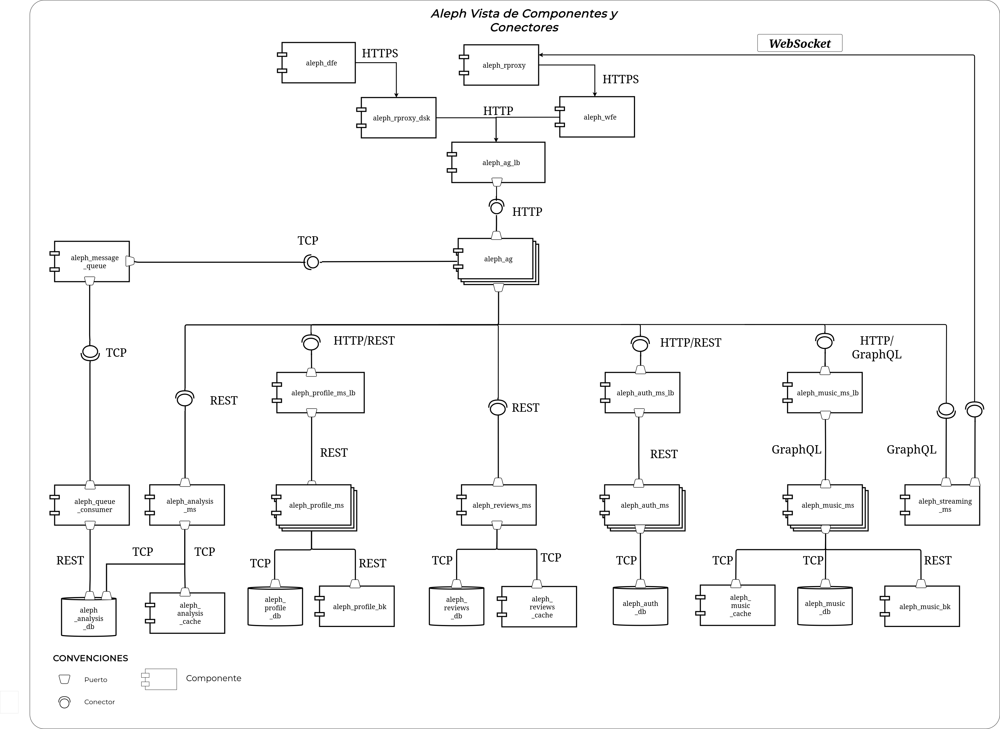
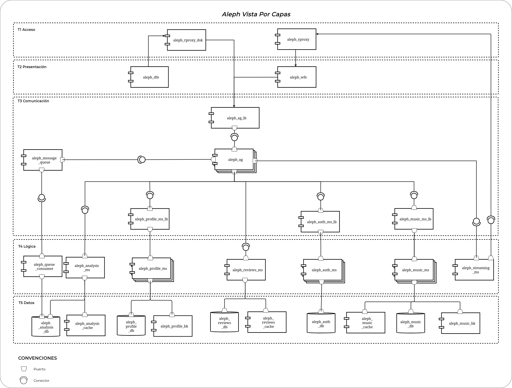
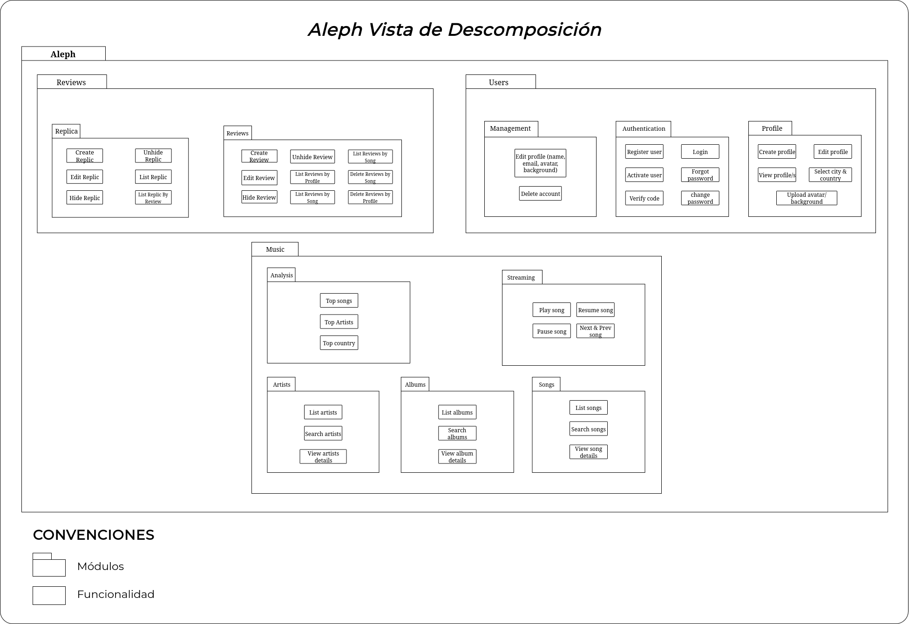
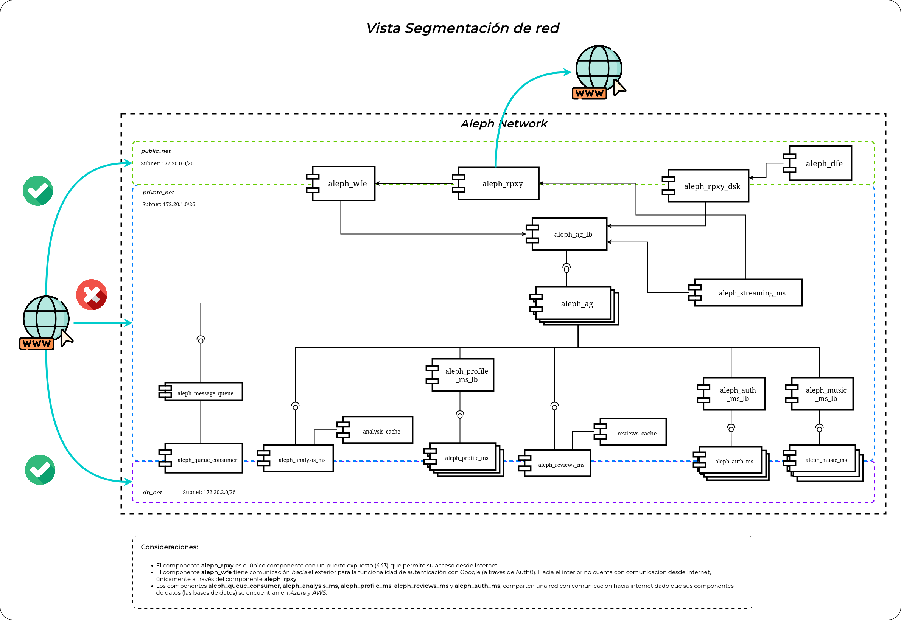
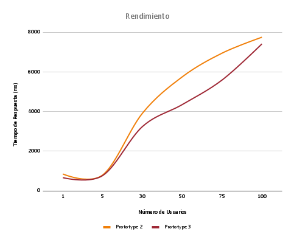

# Proyecto Grupo 1F - Prototipo 4
_**Integrantes:**_
* Angel David Piñeros Sierra (apineross@unal.edu.co)
* Catalina Gómez Moreno (catgomez@unal.edu.co) _Arquitecto líder_
* Gerardo Andrés Hormiga González (gahormigag@unal.edu.co)
* Ivana Alejandra Pedraza Hernández (ipedrazah@unal.edu.co)
* Juan Esteban Hunter Malaver (jhunter@unal.edu.co)
* Kelly Johana Solano Calderón (ksolanoc@unal.edu.co)

_**Grupo:**_ 1F

_*Profesor Jeisson Andrés Vergara Vargas*_

_*Arquitectura de Software*_


**Universidad Nacional de Colombia**  
**Facultad de Ingeniería**  
**Departamento de Ingeniería de Sistemas y Computación**
**2025-I**  

## Software System
 - **Name:** Aleph.
 - **Logo:** 
 - **Description:** Aleph es un sistema de software de música, creado para que los usuarios puedan explorar, buscar y escuchar música, artistas y álbumes dentro de una sola plataforma. Los usuarios podrán buscar canciones, artistas y álbumes de su preferencia, estándo en la capacidad de utilizar filtros para sus búsquedas en base a las categorías musicales. Seleccionar las canciones de su interés para reproducirlas e interactuar con el reproductor para así poder realizar acciones como subir o bajar el volumen, pausar, acelerar y entre otras acciones con las cuales podrán disfrutar de sus canciones. Además de poder crear listas de reproducción en base a sus gustos músicales. Aleph se caracteriza por ser un sistema donde los usuarios puedan escribir y dejar sus opiniones o comentarios tanto en canciones como en álbumes, convirtiendo a Aleph en un espacio para el intercambio de opiniones y gustos músicales.

## 2. Architectural Structures Component-and Connector (C&C) Structure
## 2.1 C&C View 

A continuación se presenta el diagrama de componentes y conectores del sistema Aleph, donde se visualizan los principales elementos arquitectónicos y sus relaciones:



## 2.2 Description of architectural styles and patterns used

### Architectural Styles

| Estilo | Descripción |
| ------------- |:-------------:|
| Microservicios | El sistema Aleph está diseñado siguiendo el estilo arquitectónico de microservicios, donde cada funcionalidad del sistema se implementa como un servicio independiente y autónomo. Esta arquitectura permite el desarrollo, despliegue y escalado independiente de cada componente del sistema. |

### Architectural Patterns

| Patrón  | Descripción |
| ------------- |:-------------:|
| API Gateway     | Se implementa un patrón de puerta de enlace (API Gateway) a través del componente  ```aleph_ag ```, el cual actúa como punto único de entrada para el sistema. Este componente orquesta las llamadas entre frontend y microservicios, permitiendo abstraer la complejidad de la arquitectura distribuida. También es capaz de componer respuestas cuando es necesario interactuar con múltiples microservicios.     |
| Arquitectura Basada en Eventos (EDA)      | El sistema utiliza Apache Kafka como tecnología de mensajería para implementar una arquitectura orientada a eventos. Cada vez que un usuario reproduce una canción, se genera un evento song-played que se publica en un topic de Kafka. Este evento es consumido por el componente  ```aleph_queue_consumer```, el cual enriquece los datos consultando otros microservicios y almacena la información en la base de datos analítica ( ```aleph_analysis_db ```). Esto permite una comunicación asincrónica, desacoplada y escalable.    |
| Cache Aside Pattern | Los microservicios de ``aleph_music_ms``, ``aleph_reviews_ms`` y ``aleph_analysis_ms``, cuentan con un almacenamiento temporal de datos por medio de Redis. Estos permite que los microservicios puedan disminuir la latencia generada en consultas repetitivas y así se aumente el rendimiento de las respuestas. |

## 2.3 Description of architectural elements and relations

### Elements

| Elemento | Tier | Descripción |
|---|---|---|
| ```aleph_rproxy (Reverse Proxy Web)``` | Acceso | Único punto de entrada entre entre el cliente Web y el sistema. Funciona como un intermediario entre el usuario y el componente de presentación web ```aleph_wfe (Web Frontend)```. Este se encarga de recibir las peticiones de los clientes y enviarlas, a través del componente de presentación y comunicación, a los componentes internos de la aplicación. Permite: proteger el sistema interno y hacer uso de SSL/HTTPS. |
| ```aleph_rproxy_dsk (Reverse Proxy Desktop)``` | Acceso | Único punto de entrada entre entre el cliente Desktop y el sistema. Funciona como un intermediario entre el usuario y el componente de presentación desktop```aleph_dfe (Desktop Frontend)```. Este se encarga de recibir las peticiones de los clientes y enviarlas, a través del componente de presentación y comunicación, a los componentes internos de la aplicación. Permite: proteger el sistema interno y hacer uso de SSL/HTTPS. |
| ```aleph_wfe (Web Frontend)``` | Presentación | Componente de presentación del sistema desarrollado con Next.js y Tailwind CSS. Permite la navegación, autenticación y gestión de usuarios, así como la visualización de canciones, reseñas y estadísticas desde el navegador. |
| ```aleph_dfe (Desktop Frontend)``` | Presentación | Aplicación de escritorio construida con Electron y Next.js. Reutiliza el frontend web, pero empacado como ejecutable independiente. Permite autenticación (correo o Google), registro, recuperación y cambio de contraseña, validación mediante códigos enviados por correo, todo integrado con Auth0. |
|```aleph_ap_lb (Load Balancer API Gateway)```| Comunicación |Se encarga de la distribución del tráfico entrante hacia alguna de las instancias de API Gateway disponibles. El balanceo está determinado por el algoritmo *Least Connection* (dirección del tráfico al servidor con menos conexiones).|
|```aleph_ag (API Gateway)```|Comunicación|Orquestador central que permite que los componentes de frontend se comuniquen con los distintos microservicios. Gestiona la recepción de peticiones HTTP (GET, POST, PATCH, DELETE), enruta hacia los microservicios apropiados y compone respuestas cuando se requiere información de múltiples fuentes.|
|```aleph_profile_ms_lb```| Comunicación | Se encarga de la distribución del tráfico dirigido hacia las instancias del microservicio ``aleph_profile_ms`` que se encuentren disponibles. El balanceo se realiza bajo el algoritmo *Least Connection*  (dirección del tráfico al servidor con menos conexiones). |
|```aleph_profile_ms```|Lógica|Microservicio encargado de gestionar la información de perfiles de usuarios, como datos personales, entre ellos su país de origen. Se apoya en una base de datos (aleph_profile_db).|
|```aleph_music_ms_lb```| Comunicación | Se encarga de la distribución del tráfico dirigido hacia las instancias del microservicio ``aleph_music_ms`` que se encuentren disponibles. El balanceo se realiza bajo el algoritmo *Least Connection*  (dirección del tráfico al servidor con menos conexiones). |
|```aleph_music_ms```|Lógica|Administra la información de artistas, canciones, álbumes y listas de reproducción personalizadas. Implementa búsqueda por filtros y visualización detallada. Utiliza ```aleph_music_db```, una base de datos MongoDB alojada en Atlas, para manejar datos flexibles (como letras, portadas, categorías).|
|```aleph_reviews_ms```|Lógica|Microservicio encargado de la gestión de reseñas para canciones y álbumes, tomando en cuenta la reseña principal, el voto realizado y los hilos de comentarios qué otros usuarios le realicen a la reseña. Este componente gestionará las operaciones de CREATE para la creación de reseñas, UPDATE para la actualización de reseñas, GET para la visualización de reseñas y DELETE para su eliminación, qué serán realizadas hacia la base de datos (```aleph_reviews_db```).|
|```aleph_auth_ms```|Lógica|	Servicio interno para autenticación, construido con Node.js, Express y TypeScript. Expone endpoints REST para registro, login, recuperación y cambio de contraseña. Utiliza JWT, correo de confirmación y se comunica con aleph_auth_db (MongoDB). Su implementación elimina la dependencia de Auth0 en entornos internos.|
|```aleph_analysis_ms```|Lógica|Microservicio de analítica que expone endpoints para obtener estadísticas como canciones más reproducidas y análisis por ubicación. Consulta directamente aleph_analysis_db, una base PostgreSQL con modelo estrella.|
|```aleph_message_queue```|Comunicación|Sistema de mensajería implementado con Apache Kafka. Recolecta eventos como song-played generados por acciones del usuario, y permite su consumo por otros servicios para análisis posterior.|
|```aleph_queue_consumer```|Lógica|	Consumer suscrito al topic de Kafka. Procesa eventos de reproducción de canciones, consulta datos a otros microservicios, enriquece la información y la almacena en ```aleph_analysis_db``` siguiendo el modelo estrella.|
|```aleph_music_db```|Data|Base de datos del microservicio de canciones, se encarga de manejar datos de las canciones, artistas y álbumes dentro del sistema (nombre del artista, duración de la canción, nombre del álbum, nombre de la canción, letra de las canciones, categorías y filtros, etc.). Para esto se optó por una base de datos MongoDB, debido a que es una base de datos flexible y escalable, permitiendo el constante crecimiento de la base de datos para las canciones, siendo la base de datos más grande para nuestro sistema. Adicionalmente, está en la capacidad de manejar documentos con estructuras variables, los cuales están incorporados en este servicio ya que los datos de las canciones manejan las portadas, letras, categorías, etc. |
|```aleph_reviews_db```|Data|Base de datos principal del microservicio de reseñas, encargada de la persistencia de las reseñas, qué incluye las reseñas (título, cuerpo, rating, fechas de creación y actualización, …), las réplicas (comentarios realizados dentro de las reseñas, representados en forma de hilos), y los votos (positivos o negativos). Es una base de datos relacional PostgreSQL.|
|```aleph_profile_db```|Data|Base de datos principal del ```aleph_profile_ms```, encargada de almacenar información estructurada de usuarios (nombre, biografía, fecha de cumpleaños, etc.). Será una base de datos PostgreSQL.|
|```aleph_profile_bk```|Data|Almacenamiento de objetos en Amazon S3 (Simple Storage Service) diseñado para guardar archivos asociados a perfiles de usuarios, como imágenes de avatar y portadas.|
|```aleph_auth (Componente externo SaaS)```|---|Auth0 se utilizó en el sistema de Aleph como proveedor externo de identidad utilizado para la gestión centralizada de autenticación de usuarios. Este componente permite a los usuarios iniciar sesión en el sistema de forma segura mediante diferentes métodos de autenticación (correo y contraseña, o cuenta de google). Auth0 se encarga del flujo completo de autenticación, generación de tokens (ID Token y Access Token en formato JWT) y manejo seguro de sesiones. Una vez autenticado, el usuario recibe un Access Token que es utilizado para autorizar solicitudes hacia los microservicios internos del sistema (cómo Profile, Songs o Review). Auth0 también proporciona endpoints para registro, recuperación de contraseñas, y validación de sesiones activas.|
|```aleph_auth_db```|Data|Base de datos MongoDB, alojada en MongoDB Atlas (en un clúster de AWS), utilizada por el microservicio de autenticación para el almacenamiento y recuperación eficiente de usuarios. Su estructura flexible permite adaptarse fácilmente a cambios futuros en el modelo de autenticación, como la integración de nuevos métodos (ej. biometría o redes sociales).|
|```aleph_music_bk```|Data|Para guardar archivos multimedia, incluyendo archivos de audio. Proporciona almacenamiento escalable y de alta disponibilidad para el contenido multimedia, facilitando el acceso rápido desde el microservicio de música y el sistema de streaming para la reproducción en tiempo real.|
|```aleph_profile_db```|Data|Base de datos principal del ```aleph_profile_ms```, encargada de almacenar información estructurada de usuarios (nombre, biografía, fecha de cumpleaños, etc.). Será una base de datos PostgreSQL.|
|```aleph_analysis_db```|Data|Base de datos de análisis para consultas multidimensionales. Implementa un modelo en estrella con una tabla de hechos principal (FactTableSongPlayed) y dimensiones como DimUser, DimSong, DimArtist, DimAlbum, DimLocation y DimTime. Su objetivo es permitir análisis rápidos sobre el comportamiento de reproducción dentro de Aleph.|
|```aleph_analysis_cache```|Data|Este componente se encarga de almacenar en caché (utilizando Redis) los resultados de análisis generados por el microservicio de análisis (aleph_analysis_service), como top-songs.|
|```aleph_reviews_cache```|Data|Almacena en Redis las reseñas de albumes, canciones y perfiles.|
|```aleph_music_cache```|Data|Este componente gestiona el caché de resultados relacionados con catálogos musicales y metadatos de pistas.


### Relations
| Componente 1  | Componente 2 | 	Tipo de Conector| Descripción|
|----------|----------|----------| ----------|
| ```aleph_rproxy_dsk```   | ```aleph_dfe```   |HTTPS|Enrutamiento de solicitudes del escritorio del usuario desde el proxy inverso hacia el desktop frontend.|
| ```aleph_rproxy```   | ```aleph_wfe```   |HTTPS|Enrutamiento de solicitudes web desde el proxy inverso hacia el web frontend.|
| ```aleph_rproxy```   | ```aleph_ag_lb```   |HTTP|Enrutamiento de solicitudes web externas desde el reverse proxy hacia el balanceador del API Gateway.|
| ```aleph_rproxy_dsk```   | ```aleph_ag_lb```   |HTTP|Enrutamiento de solicitudes del escritorio del usuario externas desde el reverse proxy hacia el balanceador del API Gateway.|
| ```aleph_ag_lb```   | ```aleph_ag```   |HTTP|Balanceo de carga para solicitudes al API Gateway.
| ```aleph_ag```   | ```aleph_message_queue```   |TCP|Publicación de eventos como: song-played.|
| ```aleph_message_queue```   | ```aleph_queue_consumer```   |TCP|Consumo de eventos de reproducción para procesamiento analítico.|
| ```aleph_queue_consumer```   | ```aleph_analysis_db```   |REST|Inserción e una base de datos PostgreSQL estructurada bajo modelo estrella.|
| ```aleph_ag```   | ```aleph_analysis_ms```   |HTTP - REST|Consultas analíticas solicitadas desde el frontend.
| ```aleph_analysis_ms```   | ```aleph_analysis_db```   |TCP|Lectura de datos analíticos para generar reportes.|
| ```aleph_analysis_ms```   | ```aleph_analysis_cache ```   |TCP|	Cacheo de resultados analíticos frecuentemente consultados.|
| ```aleph_ag```   | ```aleph_profile_ms_lb```   |HTTP - REST|	Acceso balanceado al microservicio de perfiles.
| ```aleph_profile_ms_lb```| ```aleph_profile_ms```   |HTTP - REST|	Balanceo de carga hacia la lógica del microservicio de perfiles.
| ```aleph_profile_ms```   | ```aleph_profile_db```   |TCP|Persistencia de datos de usuario.|
| ```aleph_profile_ms```   | ```aleph_profile_bk```   |REST|Almacenamiento de archivos relacionados a usuarios (Haciendo uso de S3).|
| ```aleph_ag```   | ```aleph_reviews_ms```   |HTTP - REST|Gestión de reseñas y votos a través del API Gateway.|
| ```aleph_reviews_ms```   | ```aleph_reviews_db```   |TCP|Persistencia de reseñas y votaciones.|
| ```aleph_reviews_ms```   | ```aleph_reviews_cache```   |TCP|Almacenamiento en caché de reseñas consultadas frecuentemente.|
| ```aleph_ag```   | ```aleph_auth_ms_lb```   |HTTP - REST|Acceso a endpoints de autenticación desde el frontend vía el API Gateway.|
| ```aleph_auth_ms_lb```   | ```aleph_auth_ms```   |HTTP - REST|Balanceo de carga para el microservicio de autenticación.|
| ```aleph_auth_ms```   | ```aleph_auth_db```   |TCP|Base de datos con credenciales.|
| ```aleph_ag```   | ```aleph_music_ms_lb```  |HTTP - GraphQL|	Enrutamiento balanceado hacia el microservicio de música.|
| ```aleph_music_ms_lb```   | ```aleph_music_ms```  |HTTP - GraphQL|Balanceo de carga para acceso a catálogos musicales.|
| ```aleph_music_ms```   | ```aleph_music_db```   |TCP|	Metadatos musicales y relaciones con artistas, álbumes y géneros.|
| ```aleph_music_ms```   | ```aleph_music_bk```   |REST|	Almacenamiento de archivos de audio (tracks).|
| ```aleph_music_ms```   | ```aleph_music_cache```   |TCP|Cache de metadatos o respuestas a consultas frecuentes del catálogo.|
| ```aleph_ag```   | ```aleph_streaming_ms```   |GraphQL|	Enrutamiento a microservicio de streaming desde el API Gateway.|
| ```aleph_rproxy```   | ```aleph_streaming_ms```   |WebSocket|Manejo de conexión WebSocket desde el cliente hacia el microservicio de streaming a través del reverse proxy.|
| ```aleph_wfe```   | ```aleph_auth (SaaS)```   |HTTP/HTTPS|El frontend web usa la librería oficial de Auth0 para autenticación segura con redirección y manejo de sesión.|
| ```aleph_dfe```   | ```aleph_auth (SaaS)```   |HTTP/HTTPS|El desktop usa el SDK nativo de Auth0 para Electron, autenticando y almacenando tokens en el sistema operativo.|

## 3. Layered Structure
A continuación se presenta el diagrama de la estructura en capas del sistema Aleph, donde se visualizan las cuatro capas principales y la distribución de los componentes:



|Capa| Componentes|
|----|-------|
|Acceso|```aleph_rproxy_dsk```, ```aleph_rproxy```|
|Presentación|```aleph_wfe```, ```aleph_dfe```|
|Comunicación|```aleph_ag_lb```,```aleph_ag```, ```aleph_message_queue```, ```aleph_profile_ms_lb```, ```aleph_auth_ms_lb```, ```aleph_music_ms_lb```|
|Lógica|```aleph_queue_consumer```, ```aleph_profile_ms```, ```aleph_music_ms```, ```aleph_reviews_ms```, ```aleph_analysis_ms```, ```aleph_queue_consumer```, ```aleph_auth_ms```, ```aleph_streaming_ms```|
|Datos|```aleph_profile_db```, ```aleph_music_db```, ```aleph_reviews_db```, ```aleph_analysis_db```, ```aleph_auth_db```, ```aleph_profile_bk```, ```aleph_music_bk```, ```aleph_streaming_bk```, ```aleph_analysis_cache```, ```aleph_reviews_cache```,```aleph_music_cache```

## 4. Deployment Structure 
A continuación se presenta el diagrama de despliegue del sistema Aleph, donde se visualizan los contenedores, servicios en la nube y la distribución de los componentes. Para el desarrollo del prototipo #4, se ha cambiado la arquitectura de despliegue de Alpeh, pasando de un entorno local basado en redes Docker a una infrastructura de nube utilizando la estrategia de Elastic Conteiner Service(ECS) de Amazon Web Services(AWS). 

Inicialmente, todos los componentes y microservicios del sistema se desplegaron localmente como contenedores de DOcker. Operando dentro de la red virtual de Docker. Cada componente exponía un puerto interno para la comunicación entre los servicios y para la comunicación externa (como es en el caso del ```reverse_proxy```), se utilizaba un *puerto mapeado* hacia un puerto del host(por ejemplo, ```aleph_rproxy``` o ```aleph_rproxy_dsk```).

### Despliegue en la nube 
Actualmente, el sistema se encuentra alojado en la nube utilizando AWS ECS con la siguiente arqutectura:

- **Microservicios Desplegados**:
	- auth-ms-service: Para la gestión de autenticación y autorización de usuarios.
	- music-ms-service: Para la gestión de canciones, álbumes y artistas.
	- profile-ms-service: Para la gestión de perfiles y preferencias de los usuarios.
- **Replicación de Servicios**:
	Para microservicio se hizo replicación en tres tareas ESC(tres instancias) para mejorar la disponibilidad, tolerancia a fallos y escalabilidad del sistema.

- **Balanceo de carga**:
	Cada microservisio está conectado a su propio balanceador de carga de aplicación (ALB). Estos balanceadores permiten distribuir el tráfico de la red entre las tres instancias en ejecución, cada una escucha al **puerto 3002**.

- **Configuración de los Puertos**:
	Todos los microservicios exponen sus APIs a través del **puerto 3002**, configurado tanto en las definiciones de tareas ECS como en las reglas de escucha de los balanceadores.


## 5. Decomposition Structure
A continuación se presenta el diagrama de descomposición del sistema Aleph, donde se visualizan las funcionalidades principales y la distribución de los componentes involucrados:
#### Módulos 
- *Módulo de Users*
Módulo encargado del manejo y control de las cuentas de los usuarios dentro del sistema. Se conforma por los submódulos de *Management*, *Authentication* y *Profile*. 

- *Módulo de Reviews*
Módulo encargado de la gestión de reseñas y replicas dentro del sistema. Esta orientado hacia las reseñas de la canciones que son realizadas por los usuarios de la plataforma. Así mismo, como los comentarios a dichas reseñas (replicas), también realizadas por los usuarios de la plataforma. 

- *Módulo de Music*
Conformado por los submódulos de analysis, streaming, artistis, albums y songs. Es el módulo principal del sistema, que se enfoca que brindar las funcionalidades de visualizacioń de artistas, sus álbumes y canciones. Brinda la posibilidad de reproducir las canciones y ver información detallada de la misma. El módulo de música cuenta con un análisis de número de reproducciones de canciones, artistas más escuchados y reproducciones por país. 



## 6. Quality Attributes (Security)
## 6.1. Secure Chanel Pattern
### Scenario:
| Elemento             | Descripción del Comportamiento del Sistema                                                                                                                      |
|----------------------|----------------------------------------------------------------------------------------------------------------------------|
| **Source**           | Atacante con capacidad de hacer sniffing de red (Man-in-the-Middle en red pública o comprometida)                         |
| **Stimulus**         | El atacante intercepta una solicitud enviada por un cliente al sistema que contiene credenciales o datos sensibles         |
| **Environment**      | Producción; clientes acceden mediante internet, proxy configurado con HTTPS y certificados válidos                         |
| **Artifact**         | Datos sensibles transmitidos entre clientes y el sistema                                                                   |
| **Response**         | El reverse proxy negocia conexión TLS con el cliente, cifra los datos desde el inicio; el atacante no puede leer el contenido capturado |
| **Response Measure** | Se garantiza la confidencialidad de los datos en tránsito del usuario mediante el uso de TLS(HTTPS). Haciendo que los datos se cifren de extremo a extremo. |

### Tácticas arquitectónicas aplicadas:
* Encriptar los datos en el transito
* **Terminate TLS at entry point:** El reverse Proxy es el encargado del proceso de encriptado y desencriptado evitando llevar esa carga extra a los componentes de logica dentro de la arquitectura.

### Patrones aplicados:
* Secure Channel Pattern (TLS/HTTPS)
* Reverse Proxy

## 6.2 Reverse Proxy Pattern

### Scenario:
| Elemento             | Descripción del Comportamiento del Sistema                                                                                                                      |
|----------------------|----------------------------------------------------------------------------------------------------------------------------|
| **Source**           | Un atacante o servicio no autorizado ubicado en la red `public_net` intenta acceder directamente a un microservicio interno ubicado en la red `private_net`.                                                     |
| **Stimulus**         | El atacante realiza una petición HTTP o un intento de conexión TCP/UDP desde una red externa hacia un microservicio o componente privado (ej. `aleph_profile_ms`) sin pasar por el flujo de peticiones establecido en la arquitectura.       |
| **Environment**      | Producción, arquitectura desplegada con reverse proxy activo                                                                |
| **Artifact**         | Arquitectura de Aleph protegida detrás del reverse proxy                                                            |
| **Response**         | El reverse proxy intercepta y bloquea cualquier acceso directo a rutas no expuestas (por ejemplo, `/api/internal`), evitando que lleguen al backend |
| **Response Measure** | Se bloquean los intentos de acceso directo a los microservicios internos desde redes externas. Se asegura que los componentes internos permanezcan ocultos y protegidos. |

### Tácticas arquitectónicas aplicadas:
* **Ofuscacion de arquitectura:** Los componentes de la arquitectura de Aleph no son visibles desde fuera.

* **Reducir la superficie de ataque:** Se establece como unico punto de entrada a la arquitectura desde el exterior al reverse proxy, reduciendo asi la superficie de ataque.

* **Reestringir el acceso:** Desde el reverse Proxy se controla el rate limiting de las peticiones basadas en su origen, lo que nos permite tener control sobre las peticiones que entran al sistema.

### Patrones aplicados:

* **Reverse Proxy Pattern**

* **Facade Pattern**


## 6.3 Network Segmentation Pattern

### Scenario:
| Elemento         | Descripción del Comportamiento del Sistema                                                                                                                                    |
|------------------|---------------------------------------------------------------------------------------------------------------------------------------------------------------------|
| **Source**       | Un atacante o servicio no autorizado ubicado en la red `public_net` intenta acceder directamente a un microservicio interno ubicado en la red `private_net`.         |
| **Stimulus**     | El atacante realiza una petición HTTP o un intento de conexión TCP/UDP desde una red externa hacia un microservicio o componente privado (ej. `aleph_ag`).                              |
| **Environment**  | El sistema está desplegado en Docker con redes virtuales segmentadas: `public_net`, `private_net` y `ms_net`. |
| **Artifact**     | Microservicios internos (como `aleph_ag`) que están definidos únicamente en `private_net`.                                   |
| **Response**     | **Bloqueo de conexión por aislamiento de red** El sistema impide que un contenedor acceda a otro que no comparta la misma red. Docker, automáticamente bloquea la comunicación entre redes distintas, así evitando el acceso de puntos no autorizados a servicios importantes.|
| **Response Measure** | **Tasa de Éxito.** Se cálcula la tasa de éxito de acuerdo al número de intentos de conexión provinientes de redes no autorizadas, que fueron efectivamente bloqueadas por la segmentación de red. |

### Tácticas Aplicadas:
* *Se divide la red por capas* que limitan el alcance de los usuarios y posibles atacantes a los componentes internos y sensibles del sistema. Se definen redes virtuales en Docker llamadas `private_net`, `public_net`, `ms_net`. Los contenedores en `private_net` están completamente aislados de `public_net`. Además, los servicios en `public_net` no exponen puertos al host, por lo que no pueden ser accedidos directamente desde fuera del entorno Docker. Las redes públicas están configuradas para permitir únicamente el tráfico saliente (*inside-out*).
* **Limit Access:** Se restringe el acceso a los recursos del sistema por servicios que no estén autorizados. Se aplica la validación por Tokens JWT antes de ingresar a los microservicios requeridos, asegurando que solo los componentes definidos para su comunicación puedan interactuar entre sí.
  
### Patrones Aplicados:
* **Network Segmentation**

## 6.4 Tokens validation pattern
### Scenario:
| Elemento             | Descripción del Comportamiento del Sistema                                                                                                                                                       |
|----------------------|-------------------------------------------------------------------------------------------------------------------------------------------------------------------|
| **Source**           | Un usuario no autenticado (Posible atacante) intenta acceder a un microservicio protegido (`reviews-ms`, `profile-ms`, `music-ms`, etc.) mediante una solicitud HTTP. |
| **Stimulus**         | Solicitudes HTTP enviadas con Tokens JWT inválidos, expirados, manipulados o ausentes.                                                        |
| **Environment**      | Sistema de microservicios desplegado con Docker, donde todas las solicitudes pasan a través del API Gateway `aleph_ag`, el cual se encarga de validar la autenticidad y la duración de los tokens.                          |
| **Artifact**         | El componente `aleph_ag`, siendo responsable de validar los tokens antes de reenviar la petición al microservicio correspondiente.                                |
| **Response**         | El API Gateway `aleph_ag` rechaza la solicitud si el token es inválido, ha expirado, ha sido manipulado o no está presente, bloqueando el acceso  y retornando un error 401.         |
| **Response Measure** | **Cantidad de peticiones bloqueadas por autenticación fallida**, ya sea por tokens inválidos, que hayan expirado o ausentes.                                          |

### Tácticas Aplicadas
* **Authenticate Actor:** El sistema verifica la identidad del usuario o servicio que está solicitando acceder a un componente o recurso del sistema que se encuentra protegido. El sistema verifica la autenticación del usuario mediante Tokens JWT para cada solicitud que realice. Para esto, el API Gateway actúa como el único punto de entrada para dichas solicitudes y las verifica. Si el Token es valido, redirige la petición al microservicio, si no es válido, rechaza la petición.  

	
## 6.5 Rate Limiting pattern
### Scenario:
| Elemento             | Descripción del Comportamiento del Sistema                                                                                                                      |
|----------------------|----------------------------------------------------------------------------------------------------------------------------|
| **Source**           | Un usuario o script automatizado intenta realizar un número excesivo de solicitudes al sistema en un corto periodo de tiempo. |
| **Stimulus**         | Envío de múltiples solicitudes HTTP (por ejemplo, más de 100 por minuto) desde una misma IP o usuario.                      |
| **Environment**      | Producción, con el reverse proxy y/o API Gateway configurados para aplicar límites de tasa a las solicitudes entrantes.     |
| **Artifact**         | Reverse proxy y API Gateway, responsables de aplicar límites de tasa y bloquear solicitudes excesivas.                      |
| **Response**         | El sistema detecta el exceso de solicitudes y responde con un error 429 Too Many Requests, bloqueando temporalmente al origen infractor. |
| **Response Measure** | Porcentaje de solicitudes bloqueadas por exceder el límite de tasa; reducción de riesgo de denegación de servicio (DoS).    |

### Tácticas Aplicadas
* **Limit Access:** Se restringe el acceso a los recursos del sistema por servicios que no estén autorizados. Se aplica la validación por Tokens JWT antes de ingresar a los microservicios requeridos, asegurando que solo los componentes definidos para su comunicación puedan interactuar entre sí.

## 6. Quality Attributes (Performance and Scalability)

## 6.6 Load Balancing
### Scenario:
| Elemento             | Descripción del Comportamiento del Sistema                                                                                                                      |
|----------------------|----------------------------------------------------------------------------------------------------------------------------|
| **Source**           | Múltiples usuarios simultáneamente acceden al sistema ocasionando alta demanda y generando un aumento en el volumen de las soclicitudes hacia el microservicio de perfil.     |
| **Stimulus**         | Cada usuario realiza una consulta al microservicio de perfiles (por ejemplo, acceder a su perfil)     |
| **Environment**      | Entorno de producción, bajo carga pico (por ejemplo, en horas de alta actividad), con un balanceador de carga distribuyendo peticiones entre las multiples instancias del microservicio de perfiles |
| **Artifact**         | Arquitectura de Aleph          |
| **Response**         | El balanceador de carga distribuye equitativamente las solicitudes entre las instancias disponibles, evitando saturación individual y asegurando un tiempo de respuesta aceptable |
| **Response Measure** | Se calculan los tiempos de respuesta promedio y la cantidad de recursos que utiliza el microservicio en cada instancia. Se realizan pruebas de carga para verificar que ninguna instancia se sature y que el sistema mantenga los tiempos de respuesta estables.|

### Tácticas arquitectónicas aplicadas:
* Maintain multiple copies: Desplegar múltiples instancias del microservicio
* Control resource demand: Cada instancia maneja un subconjunto de tráfico
* Manage Resources: El balanceo de carga permite distribuir eficientemente el uso de recursos disponibles entre múltiples instancias de un servicio.
* Increase Resources: porque se habilita la incorporación de nuevas instancias (escalado horizontal) que pueden ser gestionadas por el balanceador para mejorar el rendimiento general del sistema.


### Patrones aplicados:
* Load Balancer Pattern

## 6.7 Db Caching
### Scenario:
| Elemento             | Descripción del Comportamiento del Sistema                                                                                                                      |
|----------------------|----------------------------------------------------------------------------------------------------------------------------|
| **Source**           | Múltiples usuarios acceden simultáneamente al sistema tras el lanzamiento de un nuevo álbum. Se genera una carga grande al microservicio de música (aleph_music) y su base de datos(aleph_music_db).  |
| **Stimulus**         | El artista más popular de la plataforma lanza un nuevo álbum, y se realizan más de 10,000 solicitudes por minuto al microservicio de música para acceder a las canciones del álbum |
| **Environment**      | Producción; minutos posteriores al lanzamiento, bajo carga extrema, con sistema en operación normal                        |
| **Artifact**         | Microservicio de música, Redis cache, balanceador de carga, instancias escalables                                         |
| **Response**         | El microservicio responde rápidamente a las solicitudes usando Redis para cachear metadatos del álbum y canciones, y balanceador de carga para distribuir tráfico entre varias instancias |
| **Response Measure** | Se toma el tiempo promedio de respuesta del microservicio de música en el caché Redis, durante el lanzamiento del albúm. Se evalúa el rendimiento mediante la reducción de cosultas directas a la base de datos y el uso de la memoria caché. |

### Tácticas arquitectónicas aplicadas:

* Manage Resources: El uso de caché reduce la carga sobre las bases de datos principales, liberando recursos y mejorando la eficiencia del sistema.
* Reduce Computational Overhead: Evita el cómputo repetido de resultados ya generados, almacenándolos en memoria para accesos rápidos.


### Patrones aplicados:
* Cache Aside Pattern: Las canciones y metadatos del álbum están cacheados desde el primer acceso

### Patrones aplicados:
* Load Balancer Pattern

## 6. Quality Attributes (Reliability)

## 6.8 Replication Pattern
### Scenario:
| Elemento             | Descripción del Comportamiento del Sistema                                                                                                                      |
|----------------------|----------------------------------------------------------------------------------------------------------------------------|
| **Source**           | Un usuario intenta autenticarse al sistema Aleph durante un aumento del tráfico de la red.  |
| **Stimulus**         | Varios usuarios intentan iniciar sesión simultáneamente, pero una de las instancias de autenticación auth-ms se inactiva por una falla ocasionada. |
| **Environment**      | Entorno de producción de AWS, con 3 instancias del microservicio `auth-ms`, que están replicadas por ECS y son gestionadas por un balanceador de carga.              |
| **Artifact**         | Microservicio de Autenticación, Load Balancer.    |
| **Response**         | El balanceador de carga redirige las nuevas solicitudes hacia las instancias disponibles del microservicio de autenticación replicado (`auth-ms`).|
| **Response Measure** | Se calcula la tasa de éxito de la autenticación de usuarios durante la falla. |

### Tácticas arquitectónicas aplicadas:

* Redundacy Spare: Se mantienen múltiples instancias activas y disponibles para tomar la carga en caso de que una instancia falle.
* Failover: EL balanceador de carga detecta fallas y redirige las peticiones a instancias que están disponibles.


### Patrones aplicados:
* Replication Pattern.
* Load Balancer Pattern.

## 6.8 Service Discovery Pattern
### Scenario:
| Elemento             | Descripción del Comportamiento del Sistema                                                                                                                      |
|----------------------|----------------------------------------------------------------------------------------------------------------------------|
| **Source**           | Se crea una nueva instancia del microservicio de música music-ms.  |
| **Stimulus**         | El sistema crea una nueva instancia de `music-ms` como respuesta a un aumento de tráfico, la cual necesita recibir solicitudes a través de balanceador de carga. |
| **Environment**      | Entorno de producción en AWS con los microservicios de `music-ms`, `auth-ms` y `profile-ms` desplegados.          |
| **Artifact**         | Microservicio de música, Service Discovery de AWS. |
| **Response**         | La nueva instancia de `music-ms` se registra en el service registry. De manera que las nuevas solicitudes a música se pueden enrutar hacia la nueva instancia sin configuración manual. |
| **Response Measure** | Se mide el tiempo de creación de la instancia y la disponibilidad de la misma para recibir el nuevo tráfico dentro de la red. Con esto se confirma que la instancia recibe las solicitudes.|

### Tácticas arquitectónicas aplicadas:

* Redundancy – Active: Varias instancios del mismo servicio están activas al mismo tiemo, para garantizar la disponibilidad continua y tolerancia a fallos de Aleph.


### Patrones aplicados:
* Service Discovery Pattern.
* Load Balancer Pattern.


## 6.9 Clusters Pattern
### Scenario:
| Elemento             | Descripción del Comportamiento del Sistema                                                                                                                      |
|----------------------|----------------------------------------------------------------------------------------------------------------------------|
| **Source**           | El nodo del clúster en ECS falla repentinamente(sea por un error de red o una pérdida de conexión con AWS) |
| **Stimulus**         | Una de las instancias que ejecuta el microservicio de perfiles `profile-ms` dentro del clúster se inactiva o deja de responder por la falla ocasionada. |
| **Environment**      | Entorno de producción en AWS que posee varias instancias de los servicios (en este caso `profile-ms`) distribuidas dentro de un clúster con su balanceador de carga.   |
| **Artifact**         | Microservicio de perfiles, Clúster, load balancer. |
| **Response**         | El clúster nota la caida del nodo y crea una nueva instancia del microservicio de perfiles en un nodo que esté disponible. El balanceador de carga actúa y deja de enviar las peticiones a la instancia fallida, las redirige a las disponibles.|
| **Response Measure** | Se mide el tiempo de recuperación del sistema (failover) desde que ocurre la detección del fallo hasta que la nueva instancia esté disponible y en función. |

### Tácticas arquitectónicas aplicadas:

* Redundancy – Active: Varios nodos activos o de respaldo pueden tomar la ejecución del servicio si uno falla.
* Fault detection and Recovery: El clúster está en la capacidad de detectar fallas de forma automática y actúa sin necesidad de intervención.


### Patrones aplicados:
* Cluster Pattern.
* Replication Pattern.
* Load Balancer Pattern.


## 6.10 Healthcheck 
### Scenario:
| Elemento             | Descripción del Comportamiento del Sistema                                                                                                                      |
|----------------------|----------------------------------------------------------------------------------------------------------------------------|
| **Source**           | El sistema de monitoreo de AWS (siendo load balancer + los healthcheck).|
| **Stimulus**         | Una instancia de uno de los microservicios desplegados (`music-ms`, `profile-ms`, `auth-ms`) deja de responder en su endpoint de health. |
| **Environment**      | Entorno de producción en AWS con los servicios desplegados (en este caso `profile-ms`) cada uno etiquetado con ‘tags’ y sus configuraciones de healthcheck.|
| **Artifact**         | Microservicio de autenticación, microservicio de perfiles, microservicio de música, load balancer.|
| **Response**         | Por medio del health el balanceador de carga detecta que la instancia del microservicio no responde a los helth checks y la marca como unhealthy. Detiene la instancia y crea una nueva para asegurar la disponibilidad del servicio.|
| **Response Measure** | Se mide el tiempo desde que la instancia falla el health check hasta que se reemplaza por una nueva. Se confirma que las instancias del unhealthy no recibe tráfico y que la recuperación ocurre sin interrupciones.|

### Tácticas arquitectónicas aplicadas:
* Health Monitoring(Healthcheck): SE realiza una verificación periódica del estado de cada instancia mediante los endpoints expuestos.
* Redundation Spare: AL haber varias instanscias (3 por cada microservicio), se pueden privar de una mientras se recupera el servicio.


### Patrones aplicados:
* Load Balancer Pattern


# 7 Pruebas de rendimiento
#### 7.1 Pruebas automatizadas con k6 (Rendimiento general del sistema)

Se utilizó la herramienta k6 para realizar pruebas automatizadas de carga y rendimiento sobre el sistema completo, ejecutando escenarios de usuarios concurrentes y midiendo el tiempo de respuesta de los endpoints principales a través del API Gateway.

La siguiente imagen muestra el rendimiento general del sistema bajo carga simulada con k6:




#### 7.2 Pruebas individuales con JMeter (Microservicios)

Para evaluar el rendimiento de cada microservicio de manera aislada, se empleó Apache JMeter. Se diseñaron planes de prueba específicos para cada microservicio, midiendo latencia, throughput y tasa de errores bajo diferentes niveles de concurrencia.

A continuación se presentan gráficas de rendimiento obtenidas con JMeter:

  
Rendimiento de analysis-ms y music-ms:

  


  
Rendimiento de auth-ms, profiles y reviews:

  

  En general, para los microservicios de caching se encuentra la knee para valores altos (carga de 100) , esto dado a que la información que consultan en los tests es cacheada satisfactoriamente. Estos servicios son de los más importantes para nuestro sistema y hacen parte de las funcionalidades core del mismo, por esto la relevancia de estos resultados. Para otros microservicios (Rendimiento de auth-ms, profiles y reviews) los cuales no se les aplicaron patrones y tácticas, su knee se encuentra en valores de carga inferiores a 50.  
  
  
## Prototype

1. **Realizar instalaciones previas**
   - Poseer Docker instalado y Docker compose en la máquina.
     
2. **Clonar el repositorio**
   - Deberá clonar el repositorio desde GitHub en el escritorio el cual ejecutará el sistema. Podrá hacerlo con el siguiente comando desde Git:
	```bash
	git clone <https://github.com/unal-swarch/swarch2025i/tree/prototype_3/project/prototype_3/1F>
 	```
4. **Establecer variables de entorno**
    - Cambie la ruta desde su terminal para así dirigirse a la ruta del proyecto:
 	```bash
	cd swarch2025i/project/prototype_3/1F
	```
     -  Cree los archivos `.env` necesarios en cada microservicio que los requiera o para Docker Compose. Asegúrase de definir correctamente las variables de entorno requeridas (puertos, 	credenciales, claves, etc.).
5. **Configurar los contenedores**
   - Una vez hayas configurado el sistema, con sus archivos `.env`, podrá desplegar todos los contenedores de nuestro sistema para crear debidamente los componentes. Podrá realizarlo por medio del siguiente comando:
	```bash
	docker compose up --build
	```

6. **Despliegue**
   - Verifique que todos los contenedores estén corriendo correctamente:
     	```bash
     	docker ps
     	```
   - Puedes revisar los logs de los servicios para asegurarte de que no haya errores:
     	```bash
     	docker compose logs -f
     	```
7. **Acceso al sistema**
   - Podrá acceder a nuestro sistema desde el navegador web con la URL y el puerto configurados.
   - Si desea ejecutar el sistema desde el escritorio (Aleph Desktop). Es importante que ejecute el siguiente comando:
     
	```bash
     	npm run build
